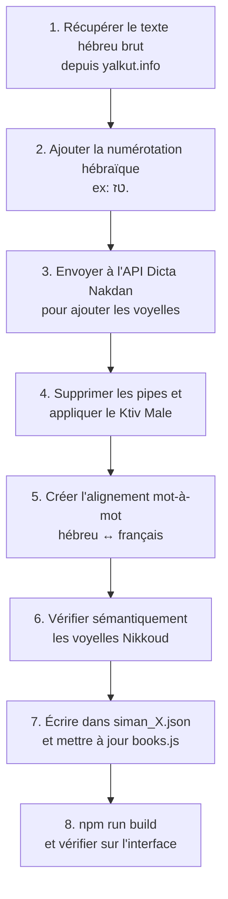

# Mishné Mikra — Halakh'App 📖✡️

> **Application web interactive d'apprentissage de la Halakha (loi juive) basée sur le Kitsour Yalkout Yossef, avec traduction bilingue mot-à-mot hébreu-français.**

---

## 🎯 Vision du Projet

Mishné Mikra (« Étude de la Lecture ») est une application web éducative conçue pour permettre aux francophones d'étudier la Halakha directement depuis les textes hébraïques originaux du **Kitsour Yalkout Yossef** du Rav Ovadia Yossef זצ"ל.

L'objectif principal est de **démocratiser l'accès aux textes halakhiques** pour les personnes qui ne maîtrisent pas (encore) l'hébreu rabbinique, en offrant :

- Une **traduction mot-à-mot interactive** (survolez un mot hébreu → sa traduction française apparaît)
- Un **texte vocalisé** (Nikkoud/voyelles) pour apprendre à lire correctement
- Une **traduction fluide** du paragraphe entier pour comprendre le sens global
- Un système de **gamification** (XP, streaks, badges, quiz) pour motiver l'apprentissage quotidien

---

## 🏗️ Architecture Technique

### Stack
| Technologie | Rôle |
|---|---|
| **React 18** | Interface utilisateur (SPA) |
| **Vite 5** | Build tool & dev server |
| **TailwindCSS 3** | Styling (dark mode, responsive) |
| **JSON statique** | Base de données des textes (`public/data/`) |
| **API Dicta Nakdan** | Génération des voyelles hébraïques (scripts de build) |
| **API Yalkut.info** | Source des textes halakhiques bruts |

### Arborescence principale
```
Halakha Learning/
├── public/
│   └── data/
│       ├── siman_1.json          # Données du Siman 1 (59 seifim au total)
│       └── yalkout-318.json      # Données du Siman 318 (Shabbat)
├── src/
│   ├── App.jsx                   # Routeur principal, gestion d'état globale
│   ├── components/
│   │   ├── WelcomeScreen.jsx     # Écran d'accueil, bibliothèque, quiz quotidien
│   │   ├── ReaderScreen.jsx      # Lecteur bilingue interactif (cœur de l'app)
│   │   ├── LearningScreen.jsx    # Parcours d'apprentissage gamifié (quiz, badges)
│   │   ├── AIScreen.jsx          # Chat IA pour poser des questions halakhiques
│   │   ├── SettingsModal.jsx     # Paramètres (thème, taille de texte)
│   │   ├── BookCover.jsx         # Couverture visuelle des livres
│   │   ├── ConfettiCanvas.jsx    # Animation de confettis (récompenses)
│   │   └── Icon.jsx              # Composant d'icônes SVG
│   └── data/
│       ├── books.js              # Catalogue des livres + données de fallback
│       └── learningData.js       # Quiz, niveaux, badges
├── scripts/                      # Scripts Node.js de génération des données
├── INSTRUCTIONS_GENERATION_TEXTES.md  # Guide officiel pour la génération IA
└── SPEC.md                       # ← Ce fichier
```

---

## 📱 Fonctionnalités Existantes

### 1. Bibliothèque (WelcomeScreen)
- **Catalogue de livres** : Liste des Simanim disponibles avec couvertures visuelles
- **Quiz quotidien** : Une question de Halakha par jour pour maintenir le streak
- **Compteur de streak** : Nombre de jours consécutifs d'étude
- **Favoris** : Accès rapide aux paragraphes mis en favoris

### 2. Lecteur Interactif (ReaderScreen) — ⭐ Cœur de l'application
- **Triple affichage** du texte :
  - 🇮🇱 Hébreu sans voyelles (texte original)
  - 🇮🇱 Hébreu avec voyelles (Nikkoud)
  - 🇫🇷 Traduction française globale
- **Survol interactif mot-à-mot** : En survolant un mot hébreu, sa traduction française est surlignée dans le texte global (et inversement)
- **Popup de vocabulaire** : Clic sur un mot → affiche la traduction littérale et l'expression de contexte
- **Navigation par Seif** : Boutons précédent/suivant, sélection directe
- **Résumé (titre_seif)** : Petit titre descriptif au-dessus de chaque paragraphe pour une lecture rapide
- **Modes de lecture** : Côte-à-côte, hébreu seul, français seul
- **Mise en favori** : Sauvegarder des paragraphes pour y revenir plus tard
- **Recherche** : Filtrer les paragraphes par mot-clé
- **Bookmark automatique** : Reprend là où vous vous êtes arrêté

### 3. Apprentissage Gamifié (LearningScreen)
- **Parcours structuré** avec des leçons progressives
- **Quiz interactifs** : QCM avec feedback immédiat
- **Système de XP** : Points d'expérience gagnés après chaque quiz réussi
- **Badges à débloquer** (Lion de Juda, etc.)
- **Confettis** animés en cas de bonne réponse 🎉

### 4. Assistant IA (AIScreen)
- **Chat conversationnel** pour poser des questions halakhiques
- Interface type messagerie instantanée
- *(À développer : connexion à un vrai backend IA)*

### 5. Paramètres (SettingsModal)
- **Thème** : Mode sombre / clair
- **Taille du texte** : Petit / Moyen / Grand
- Persistance via `localStorage`

---

## 📊 État d'Avancement des Données

### Siman 1 — הלכות השכמת הבוקר (Lois du réveil du matin)
- **Total : 59 seifim**
- **Générés : 20 / 59** (Seifim 1 à 20) ✅
- **Restants : 39** (Seifim 21 à 59)

### Siman 318 — הלכות שבת (Lois du Shabbat)
- Données brutes disponibles (`yalkout-318.json`)
- Pas encore formaté au standard de l'application

---

## 🔄 Pipeline de Génération des Données

Le processus de création d'un nouveau Seif suit ces étapes (détaillées dans `INSTRUCTIONS_GENERATION_TEXTES.md`) :



### Règles critiques
- **Source officielle** : `www.yalkut.info` uniquement
- **Voyelles** : API Nakdan (`nakdan-2-0.loadbalancer.dicta.org.il/api`) avec `genre: "rabbinic"`
- **Alignement strict** : Le nombre de mots français = le nombre de mots hébreux (split sur l'espace)
- **Audit post-API** : Toujours vérifier le Nikkoud (voir les erreurs historiques dans les instructions)
- **Numérotation** : Hébraïque (`א.`, `ב.`) + Française (`1.`, `2.`) — sans le mot "Paragraphe"
- **Résumé** : Chaque Seif doit avoir un `titre_seif` court et descriptif, sans "(Seif X)" à la fin

---

## 🚀 Fonctionnalités Futures (Roadmap)

### Court terme
- [ ] Terminer la génération des Seifim 21 à 59 du Siman 1
- [ ] Connecter l'assistant IA à un vrai backend (Gemini API)
- [ ] Ajouter plus de quiz dans le parcours d'apprentissage

### Moyen terme
- [ ] Générer les données pour d'autres Simanim (2, 3, 4...)
- [ ] Audio : prononciation des mots hébreux
- [ ] Mode "Flashcards" pour réviser le vocabulaire
- [ ] Système de progression par Siman (% de complétion)

### Long terme
- [ ] Application mobile (React Native ou PWA)
- [ ] Système de comptes utilisateurs (synchronisation multi-appareils)
- [ ] Communauté : partage de notes et discussions entre utilisateurs
- [ ] Couverture complète du Kitsour Yalkout Yossef

---

## 🛠️ Commandes utiles

```bash
# Lancer le serveur de développement
npm run dev

# Compiler pour la production
npm run build

# Prévisualiser le build de production
npm run preview
```

---

## 📝 Notes pour les développeurs / IA

- **Avant toute génération de données**, lire impérativement `INSTRUCTIONS_GENERATION_TEXTES.md`
- **Après toute modification de `siman_1.json`**, mettre à jour `src/data/books.js` (FALLBACK_PARAGRAPHS) et lancer `npm run build`
- **Les scripts de génération** sont dans le dossier `scripts/` et sont des fichiers `.cjs` (CommonJS) exécutables avec `node`
- **Le thème par défaut** est le mode sombre (dark)
- **L'application est entièrement statique** (pas de backend) — les données sont servies depuis `public/data/`
