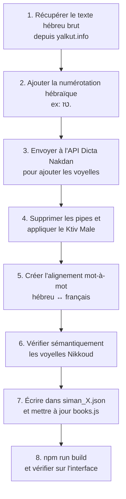

# Halakh'App 📖✡️

> **Application web interactive d'apprentissage de la Halakha (loi juive) basée sur le Kitsour Yalkout Yossef, avec traduction bilingue mot-à-mot hébreu-français.**

---

## 🎯 Vision du Projet

Halakh'App (« Étude de la Lecture ») est une application web éducative conçue pour permettre aux francophones d'étudier la Halakha directement depuis les textes hébraïques originaux du **Kitsour Yalkout Yossef** du Rav Ovadia Yossef זצ"ל.

L'objectif principal est de **démocratiser l'accès aux textes halakhiques** pour les personnes qui ne maîtrisent pas (encore) l'hébreu rabbinique, en offrant :

- Une **traduction mot-à-mot interactive** (survolez un mot hébreu → sa traduction française apparaît)
- Un **texte vocalisé** (Nikkoud/voyelles) pour apprendre à lire correctement
- Une **traduction fluide** du paragraphe entier pour comprendre le sens global
- Un système de **gamification** (XP, streaks, badges, quiz) pour motiver l'apprentissage quotidien

---

## 🏗️ Architecture Technique

### Stack
| Technologie | Rôle |
|---|---|
| **React 18** | Interface utilisateur (SPA) |
| **Vite 5** | Build tool & dev server |
| **TailwindCSS 3** | Styling (dark mode, responsive) |
| **JSON statique** | Base de données des textes (`public/data/`) |
| **API Dicta Nakdan** | Génération des voyelles hébraïques (scripts de build) |
| **API Yalkut.info** | Source des textes halakhiques bruts |

### Arborescence principale
```
Halakha Learning/
├── public/
│   └── data/
│       ├── siman_1.json          # Données du Siman 1 (59 seifim au total)
│       └── yalkout-318.json      # Données du Siman 318 (Shabbat)
├── src/
│   ├── App.jsx                   # Routeur principal, gestion d'état globale
│   ├── components/
│   │   ├── WelcomeScreen.jsx     # Écran d'accueil, bibliothèque, quiz quotidien
│   │   ├── ReaderScreen.jsx      # Lecteur bilingue interactif (cœur de l'app)
│   │   ├── LearningScreen.jsx    # Parcours d'apprentissage gamifié (quiz, badges)
│   │   ├── AIScreen.jsx          # Chat IA pour poser des questions halakhiques
│   │   ├── SettingsModal.jsx     # Paramètres (thème, taille de texte)
│   │   ├── BookCover.jsx         # Couverture visuelle des livres
│   │   ├── ConfettiCanvas.jsx    # Animation de confettis (récompenses)
│   │   └── Icon.jsx              # Composant d'icônes SVG
│   └── data/
│       ├── books.js              # Catalogue des livres + données de fallback
│       └── learningData.js       # Quiz, niveaux, badges
├── scripts/                      # Scripts Node.js de génération des données
├── INSTRUCTIONS_GENERATION_TEXTES.md  # Guide officiel pour la génération IA
└── SPEC.md                       # ← Ce fichier
```

---

## 📱 Fonctionnalités Existantes

### 1. Bibliothèque (WelcomeScreen)
- **Catalogue de livres** : Liste des Simanim disponibles avec couvertures visuelles
- **Quiz quotidien** : Une question de Halakha par jour pour maintenir le streak
- **Compteur de streak** : Nombre de jours consécutifs d'étude
- **Favoris** : Accès rapide aux paragraphes mis en favoris

### 2. Lecteur Interactif (ReaderScreen) — ⭐ Cœur de l'application
- **Triple affichage** du texte :
  - 🇮🇱 Hébreu sans voyelles (texte original)
  - 🇮🇱 Hébreu avec voyelles (Nikkoud)
  - 🇫🇷 Traduction française globale
- **Survol interactif mot-à-mot** : En survolant un mot hébreu, sa traduction française est surlignée dans le texte global (et inversement)
- **Popup de vocabulaire** : Clic sur un mot → affiche la traduction littérale et l'expression de contexte
- **Navigation par Seif** : Boutons précédent/suivant, sélection directe
- **Résumé (titre_seif)** : Petit titre descriptif au-dessus de chaque paragraphe pour une lecture rapide
- **Modes de lecture** : Côte-à-côte, hébreu seul, français seul
- **Mise en favori** : Sauvegarder des paragraphes pour y revenir plus tard
- **Recherche** : Filtrer les paragraphes par mot-clé
- **Bookmark automatique** : Reprend là où vous vous êtes arrêté

### 3. Apprentissage Gamifié (LearningScreen)
- **Parcours structuré** avec des leçons progressives
- **Quiz interactifs** : QCM avec feedback immédiat
- **Système de XP** : Points d'expérience gagnés après chaque quiz réussi
- **Badges à débloquer** (Lion de Juda, etc.)
- **Confettis** animés en cas de bonne réponse 🎉

### 4. Assistant IA (AIScreen)
- **Chat conversationnel** pour poser des questions halakhiques
- **Architecture RAG (Retrieval-Augmented Generation) 100% Locale** :
  - Un index lexical généré localement (`public/search_index.json`) regroupant 13 604 Seifim extraits du dossier `complet/`.
  - Pas de base de données backend (Firestore) requise pour la recherche, ce qui permet de rester sous les limites du plan gratuit (Spark).
- **Service IA (`aiService.js`)** :
  1. *Traduction/Extraction* : Convertit la question française en mots-clés hébreux via Gemini.
  2. *Recherche* : Cherche ces mots-clés dans l'index local.
  3. *Validation (Anti-Hallucination)* : Envoie le contexte à Gemini et vérifie que les citations renvoyées par l'IA existent bien dans les sources fournies.
- **État actuel (Août 2026)** : 
  - L'implémentation frontend, la logique RAG (searchTopSources) et la connexion Gemini sont 100% développées.
  - **Problème à résoudre** : Erreurs persistantes d'authentification et de modèles avec la Clé d'API. L'API (via le SDK standard `@google/genai` sur `generativelanguage.googleapis.com`) refuse la clé API fournie (`AQ...` ou `AIzaSy...`) avec l'erreur 400 API_KEY_INVALID ou 404 Model Not Found.
  - *Prochaine étape (reprise)* : Créer une toute nouvelle clé API standard directement depuis [Google AI Studio](https://aistudio.google.com/), la remplacer dans `src/firebase.js` et s'assurer que le modèle défini dans l'API (`gemini-1.5-flash`) y est bien accessible sans restriction.

### 5. Paramètres (SettingsModal)
- **Thème** : Mode sombre / clair
- **Taille du texte** : Petit / Moyen / Grand
- Persistance via `localStorage`

---

## 📊 État d'Avancement des Données

### Siman 1 — הלכות השכמת הבוקר (Lois du réveil du matin)
- **Total : 59 seifim**
- **Générés : 20 / 59** (Seifim 1 à 20) ✅
- **Restants : 39** (Seifim 21 à 59)

### Siman 318 — הלכות שבת (Lois du Shabbat)
- Données brutes disponibles (`yalkout-318.json`)
- Pas encore formaté au standard de l'application

---

## 🔄 Pipeline de Génération des Données

Le processus de création d'un nouveau Seif suit ces étapes (détaillées dans `INSTRUCTIONS_GENERATION_TEXTES.md`) :



### Règles critiques
- **Source officielle** : `www.yalkut.info` uniquement
- **Voyelles** : API Nakdan (`nakdan-2-0.loadbalancer.dicta.org.il/api`) avec `genre: "rabbinic"`
- **Alignement strict** : Le nombre de mots français = le nombre de mots hébreux (split sur l'espace)
- **Audit post-API** : Toujours vérifier le Nikkoud (voir les erreurs historiques dans les instructions)
- **Numérotation** : Hébraïque (`א.`, `ב.`) + Française (`1.`, `2.`) — sans le mot "Paragraphe"
- **Résumé** : Chaque Seif doit avoir un `titre_seif` court et descriptif, sans "(Seif X)" à la fin

---

## ☁️ Sauvegarde Cloud & Synchronisation Multi-Appareils (Septembre 2026)

Le système de persistance repose sur une architecture **Offline-First** avec fusion intelligente (Merge bidirectionnel) :
- **Source locale immédiate** : `localStorage` pour une vitesse instantanée et une utilisation hors-ligne.
- **Synchronisation Cloud automatique** : En arrière-plan vers Cloud Firestore (`users/{uid}` ou `users/{syncCode}`).
- **Fusion sans perte** : À la connexion ou restauration, l'application effectue l'union des leçons complétées, conserve les meilleurs scores d'examens et prend le maximum de points XP et de série (Streak).

### Deux modes d'accès utilisateur :
1. **Option A · Compte Google (Firebase Auth)** :
   - Connexion en 1 clic via popup Google.
   - Idéal pour les utilisateurs souhaitant une liaison transparente liée à leur compte email.
2. **Option B · Code Secret de Restauration (100% Anonyme)** :
   - Génération d'un code unique lisible (format `HLK-XXX-XXX`).
   - Aucun email ni mot de passe requis.
   - Saisie du code sur un nouvel appareil pour restaurer et lier la progression instantanément.

---

## 🎓 Parcours d'Apprentissage (Simanim 1, 2, 3, 4)

Chaque Siman d'apprentissage est structuré en **6 leçons progressives** :
- **3 notions clés** claires et pédagogiques par leçon.
- **3 questions interactives** (QCM à 2 choix A/B ou Vrai/Faux alternés).
- **Cartographie précise des sources** renvoyant directement aux paragraphes et lois du Kitsour Yalkout Yossef :
  - **Siman 1** : Paragraphes 1, 8, 9, etc.
  - **Siman 2** : Paragraphes 1, 3, 4, 5, 6, 11, 14, 25, 15, 16, 17, 21, 22, 24, 27, 28.
  - **Siman 3** : Paragraphes 1, 2, 6, 8, 9, 10, 13, 14, 18, 19, 23, 24.
  - **Siman 4** : Lavage des mains du matin (Netilat Yadaïm) en 6 leçons.
- **Examens de fin de Siman et Examen global de Catégorie** débloquant la fiche de synthèse.

---

## 🚀 Fonctionnalités Futures (Roadmap)

### Court terme
- [ ] Résoudre le problème de clé API pour débloquer l'Assistant IA (Gemini)
- [ ] Terminer la génération des Seifim 21 à 59 du Siman 1 (Bibliothèque d'étude)
- [x] Système de comptes et sauvegarde Cloud (Option A Google + Option B Code Secret)
- [x] Parcours d'apprentissage complet sur les Simanim 1, 2, 3 et 4 avec QCM variés

### Moyen terme
- [ ] Générer les données pour d'autres Simanim dans le parcours d'apprentissage (Siman 5, 6...)
- [ ] Système d'alerte instantanée des signalements utilisateurs (Discord Webhook / Telegram Bot)
- [ ] Audio : prononciation des mots hébreux
- [ ] Mode "Flashcards" pour réviser le vocabulaire
- [ ] Système de progression par Siman (% de complétion)

### Long terme
- [ ] Application mobile (React Native ou PWA installable)
- [ ] Communauté : partage de notes et discussions entre utilisateurs
- [ ] Couverture complète du Kitsour Yalkout Yossef

---

## 🛠️ Commandes utiles

```bash
# Lancer le serveur de développement
npm run dev

# Compiler pour la production
npm run build

# Prévisualiser le build de production
npm run preview
```

---

## 📝 Notes pour les développeurs / IA

- **Avant toute génération de données**, lire impérativement `INSTRUCTIONS_GENERATION_TEXTES.md`
- **Après toute modification de `siman_1.json`**, mettre à jour `src/data/books.js` (FALLBACK_PARAGRAPHS) et lancer `npm run build`
- **Les scripts de génération** sont dans le dossier `scripts/` et sont des fichiers `.cjs` (CommonJS) exécutables avec `node`
- **Le thème par défaut** est le mode sombre (dark)
- **L'application est entièrement statique** (pas de backend) — les données sont servies depuis `public/data/`

---

## 🚦 Télémétrie et Quotas Google (Smart Scheduler)

L'application utilise un **Smart Scheduler** avec rotation de multiples clés API (ex: 4 clés) pour traiter massivement les paragraphes.

- **Comportement des limites (Erreur 429 / 503)** : Si l'API renvoie "Quota dépassé" ou indique une pause de `59s`, **ce comportement est normal et attendu**. Le script va se mettre en veille tout seul et boucler indéfiniment jusqu'à ce que les crédits soient réinitialisés par Google. Il ne faut **surtout pas** arrêter le script manuellemment. Il reprendra son travail de manière 100% autonome.
- **Télémétrie (Dashboard)** : Le script sauvegarde un log des Seifim générés avec succès dans `logs/generation_history.jsonl`.
- **Voir les statistiques (Rythme de génération)** : Exécutez `npm run stats` dans le terminal pour afficher un tableau de bord (nombre de seifim générés par jour, et estimation du rythme).
