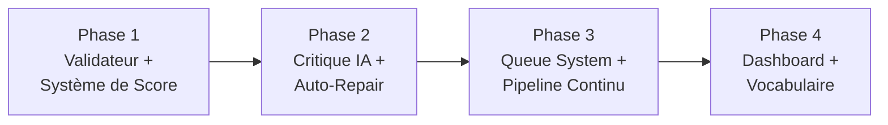

# 🏗️ Plan d'Implémentation — Pipeline Automatisé Halakh'App

## Contexte

Ton projet a aujourd'hui ~10 Simanim générés, avec un workflow semi-manuel qui nécessite beaucoup d'interventions humaines. L'objectif est de transformer ce processus en un **pipeline automatisé** qui traite les ~500 Simanim restants avec une intervention humaine minimale (seulement pour les cas douteux).

### Ce que tu as déjà et qui fonctionne bien

| Composant | Fichier | État |
|---|---|---|
| Scraper Yalkut.info | [`scrape-tzitzit.js`](file:///c:/Users/natha/OneDrive/Bureau/My%20Apps/Halakh'App/scripts/scrape-tzitzit.js) | ✅ Fonctionnel (WordPress REST API) |
| Générateur depuis fichier texte | [`generate-from-file.js`](file:///c:/Users/natha/OneDrive/Bureau/My%20Apps/Halakh'App/scripts/generate-from-file.js) | ✅ Fonctionnel (Nakdan + Gemini) |
| Générateur depuis fichier brut | [`generate-siman.js`](file:///c:/Users/natha/OneDrive/Bureau/My%20Apps/Halakh'App/scripts/generate-siman.js) | ✅ Fonctionnel (fichier source .txt) |
| Post-fix (badges, Nikkoud) | [`fix-all-seif-prefixes.js`](file:///c:/Users/natha/OneDrive/Bureau/My%20Apps/Halakh'App/scripts/fix-all-seif-prefixes.js) | ✅ Fonctionnel |
| Export par lots pour QA | [`export_seif.cjs`](file:///c:/Users/natha/OneDrive/Bureau/My%20Apps/Halakh'App/export_seif.cjs) | ✅ Fonctionnel mais à supprimer |
| 4 clés API Gemini | [`.env`](file:///c:/Users/natha/OneDrive/Bureau/My%20Apps/Halakh'App/.env) | ✅ Rotation automatique |
| Fichier source complet | [`scripts/raw/106_1_KITZUR_YALKUT_YOSEF.txt`](file:///c:/Users/natha/OneDrive/Bureau/My%20Apps/Halakh'App/scripts/raw/106_1_KITZUR_YALKUT_YOSEF.txt) | ✅ 9.5 Mo |

### Ce qui manque (problème actuel)

1. **Pas de validateur automatique** — Tu valides manuellement via AI Studio
2. **Pas de système de score** — Tu ne sais pas rapidement quels Seifim sont OK ou douteux
3. **Pas de dictionnaire de cohérence** — Le Nikkoud peut être incohérent entre Seifim
4. **Pas de dashboard** — Tu n'as aucune vue d'ensemble sur la progression
5. **Pas de critique IA automatique** — Tu copies/colles dans AI Studio manuellement
6. **Pas de queue system** — Le pipeline ne peut pas tourner en continu sans toi

---

## Approche : Construction par couches progressives

> [!IMPORTANT]
> Je recommande de construire le pipeline **en 4 phases successives**, chacune immédiatement utilisable. On ne passe à la phase suivante qu'une fois la précédente validée.



---

## Phase 1 — Validateur Déterministe + Système de Score ⭐ (Prioritaire)

**Objectif** : Remplacer 80% du travail de QA manuelle par du code.

### Pourquoi c'est la priorité absolue

ChatGPT a raison : tu demandes à une IA de vérifier ce que du code peut vérifier en microsecondes. Cette phase seule devrait **diviser ton temps de travail par 3-4x**.

---

### [NEW] `pipeline/validate.js`

Script de validation déterministe. Pour chaque Seif d'un siman_X.json, il vérifie :

| Règle | Type | Détail |
|---|---|---|
| JSON valide | Structurel | Toutes les clés requises présentes |
| Alignement correct | Structurel | `mots_alignes.length === hebreu_sans_voyelles.split(' ').length` |
| Pas de "Terme" ou "—" | Contenu | `francais_mot` ne contient pas de placeholder |
| Pas de pipes `\|` | Contenu | Nettoyage Nakdan vérifié |
| Pas de doubles espaces | Contenu | Ni dans l'hébreu, ni dans le français |
| Numérotation correcte | Structure | Badge `א.` / `1.` en position 0 |
| `titre_seif` présent | Structure | Non vide, sans "(Seif X)" |
| `sujet` et `sujet_fr` présents | Structure | Non vides |
| Ktiv Male cohérent | Nikkoud | Vérification Koubouts vs Shourouk quand le mot brut contient ו |
| Ponctuation collée | Contenu | Pas de point ou virgule isolé(e) comme mot séparé |
| Pas de mots vides dans `mots_alignes` | Contenu | Tous les `hebreu_brut` et `francais_mot` non vides |
| Hébreu dans `francais_mot` | Contenu | Détection de caractères hébreux dans la traduction française |

**Sortie** : Un fichier `pipeline/reports/siman_X_report.json` avec un score par Seif.

```json
{
  "siman": 1,
  "timestamp": "2026-08-14T15:00:00Z",
  "summary": { "total": 59, "pass": 52, "warn": 5, "fail": 2 },
  "seifim": [
    {
      "seif": 1, "status": "PASS", "score": 100,
      "checks": { "json_valid": true, "alignment": true, "no_terme": true, ... }
    },
    {
      "seif": 17, "status": "WARN", "score": 72,
      "checks": { "json_valid": true, "alignment": true, "no_terme": true, "ktiv_male": false },
      "issues": [
        { "type": "KTIV_MALE", "word_id": 12, "word": "מותר", "expected": "מוּתָּר", "got": "מֻתָּר" }
      ]
    }
  ]
}
```

---

### [NEW] `pipeline/score.js`

Calcul du score global et affichage terminal lisible :

```
╔══════════════════════════════════════════════════╗
║  HALAKH'APP — Rapport de validation              ║
╠══════════════════════════════════════════════════╣
║  Siman 1 — הלכות השכמת הבוקר                    ║
║  Total : 59 seifim                                ║
║  ✅ PASS : 52 (88%)                               ║
║  ⚠️  WARN : 5  (8%)                               ║
║  ❌ FAIL : 2  (3%)                                ║
╚══════════════════════════════════════════════════╝

  ⚠️  Seif 17 (score: 72%) — KTIV_MALE: mot 12 "מותר"
  ⚠️  Seif 23 (score: 81%) — ALIGNMENT_MISMATCH: 42 mots vs 43
  ❌ Seif 38 (score: 31%) — TERME_FOUND: 3 mots "Terme"
```

---

### [MODIFY] `package.json`

Ajout de nouvelles commandes npm :

```json
{
  "scripts": {
    "validate": "node pipeline/validate.js",
    "validate:all": "node pipeline/validate.js --all",
    "validate:siman": "node pipeline/validate.js --siman"
  }
}
```

**Usage** :
```bash
npm run validate -- --siman 1       # Valide le siman 1
npm run validate:all                # Valide tous les simanim existants
```

---

## Phase 2 — Critique IA Automatique + Auto-Repair

**Objectif** : Remplacer l'étape manuelle "export 5 par 5 → AI Studio → correction".

---

### [NEW] `pipeline/critic.js`

Appelle Gemini **uniquement** sur les Seifim en status `WARN` ou `FAIL`.

- Utilise un **prompt ciblé** : ne demande pas à Gemini de tout vérifier, mais lui montre uniquement les issues détectées et demande un verdict `PASS | FIX | ESCALATE`
- Retourne un contrat strict :
  ```json
  {
    "seif": 17,
    "verdict": "FIX",
    "fixes": [
      { "word_id": 12, "field": "hebreu_voyelles", "old": "מֻתָּר", "new": "מוּתָּר", "reason": "Ktiv Male" }
    ]
  }
  ```
- Les `ESCALATE` sont les seuls que tu devras relire manuellement

---

### [NEW] `pipeline/repair.js`

Applique les fixes retournés par `critic.js` sur le JSON :

- Modifie `siman_X.json` directement
- Garde un **log des modifications** dans `pipeline/reports/siman_X_repairs.json`
- Re-lance `validate.js` après repair pour confirmer que les fixes sont bons

---

### [NEW] `pipeline/auto-fix.js`

Corrections déterministes automatiques (pas besoin d'IA) :

| Fix | Logique |
|---|---|
| Suppression des pipes | `str.replace(/\|/g, '')` |
| Ktiv Male (Koubouts → Shourouk) | Si le mot brut contient `ו` et Nakdan a mis `ֻ`, remplacer par `וּ` |
| Doubles espaces | `.replace(/\s+/g, ' ')` |
| Points isolés | Fusionner avec le mot précédent |
| Re-indexation des IDs | `mots_alignes.forEach((m, i) => m.id = i)` |

---

## Phase 3 — Queue System + Pipeline Continu

**Objectif** : Le pipeline peut tourner **tout seul** pendant des heures, gérant les quotas et les reprises.

---

### [NEW] `pipeline/queue.js`

Système de file d'attente pour traiter les Simanim un par un :

```bash
node pipeline/queue.js --from 1 --to 500
```

Fonctionnement :
1. Charge la liste des Simanim depuis le fichier source brut
2. Pour chaque Siman pas encore traité :
   - `generate-siman.js` → génère le JSON
   - `auto-fix.js` → corrections déterministes
   - `validate.js` → calcul du score
   - Si score < 80% → `critic.js` → `repair.js` → re-validation
   - Sauvegarde le statut dans `pipeline/state.json`
3. Gestion intelligente des quotas :
   - Détection du 429 (RESOURCE_EXHAUSTED)
   - Backoff exponentiel + rotation des clés
   - Le programme se met en pause et reprend automatiquement
4. `pipeline/state.json` permet de **reprendre** là où on s'est arrêté

```json
{
  "last_processed": 42,
  "simanim": {
    "1": { "status": "complete", "score": 94, "seifim": 59 },
    "2": { "status": "complete", "score": 88, "seifim": 23 },
    "3": { "status": "in_progress", "seifim_done": 12, "seifim_total": 30 },
    "4": { "status": "pending" }
  }
}
```

---

## Phase 4 — Dashboard + Dictionnaire de Vocabulaire

**Objectif** : Vue d'ensemble et cohérence à long terme.

---

### [NEW] `pipeline/vocabulary.js`

Construit et maintient un dictionnaire de cohérence Nikkoud :

```json
{
  "המגונה": {
    "nikoud": "הַמְגֻנֶּה",
    "occurrences": [{ "siman": 1, "seif": 1 }, { "siman": 1, "seif": 14 }],
    "verified": true
  },
  "מותר": {
    "nikoud": "מוּתָּר",
    "meaning": "permis",
    "occurrences": [{ "siman": 1, "seif": 3 }, ...],
    "verified": true
  }
}
```

Ce dictionnaire sera utilisé par `validate.js` et `critic.js` pour détecter les incohérences.

---

### [NEW] `pipeline/dashboard.js`

Génère un rapport HTML statique (consultable dans le navigateur) :

```
📊 HALAKH'APP PIPELINE DASHBOARD

Simanim traités : 42 / 500 (8.4%)
Seifim totaux   : 3,241
Validés (PASS)  : 3,102 (95.7%)
En review       : 139 (4.3%)

[████████░░░░░░░░░░░░] 8.4%

┌────────┬──────────┬───────┬────────┐
│ Siman  │ Seifim   │ Score │ Status │
├────────┼──────────┼───────┼────────┤
│ 001    │ 59/59    │  94%  │ ✅     │
│ 002    │ 23/23    │  88%  │ ⚠️     │
│ 003    │ 12/30    │  —    │ 🔄     │
│ 004    │ 0/45     │  —    │ ⏳     │
│ ...    │          │       │        │
└────────┴──────────┴───────┴────────┘
```

---

## Structure du dossier `pipeline/`

```
pipeline/
├── validate.js           # Phase 1 — Validateur déterministe
├── score.js              # Phase 1 — Calcul et affichage des scores
├── auto-fix.js           # Phase 2 — Corrections déterministes
├── critic.js             # Phase 2 — Critique IA ciblée
├── repair.js             # Phase 2 — Application des corrections IA
├── queue.js              # Phase 3 — File d'attente et pipeline continu
├── vocabulary.js         # Phase 4 — Dictionnaire de cohérence
├── dashboard.js          # Phase 4 — Rapport HTML
├── lib/
│   ├── hebrew-utils.js   # Utilitaires hébreu (gematria, Nikkoud, Ktiv Male)
│   ├── gemini-client.js  # Client Gemini avec rotation de clés + backoff
│   └── constants.js      # Constantes partagées (schémas, prompts)
├── reports/              # Rapports de validation par siman
│   ├── siman_1_report.json
│   └── siman_1_repairs.json
└── state.json            # État global du pipeline
```

---

## User Review Required

> [!IMPORTANT]
> **Choix de la Phase de départ** : Je recommande de commencer par la **Phase 1** uniquement, car elle a le plus fort impact/effort ratio. Elle te permet immédiatement de valider tes 10 Simanim existants et de voir combien de Seifim sont déjà OK vs à corriger, sans toucher à la génération.

> [!WARNING]  
> **Les données existantes d'abord** : Avant de commencer la Phase 1, je vais analyser tes 10 Simanim existants pour calibrer les règles de validation. Les résultats de cette analyse détermineront les seuils de score.

## Open Questions

> [!IMPORTANT]
> **Source de données pour les Simanim futurs** : Tu as deux sources de texte brut :
> 1. Le fichier `scripts/raw/106_1_KITZUR_YALKUT_YOSEF.txt` (9.5 Mo) — contient-il TOUS les ~500 Simanim ou seulement une partie ?
> 2. Le site `www.yalkut.info` via WordPress REST API — est-ce que tous les Simanim y sont disponibles ?
> 
> Cela détermine si le scraper doit être la source principale ou si le fichier local suffit.

> [!IMPORTANT]
> **Validation du Nikkoud par humain** : Certaines corrections de Nikkoud nécessitent un vrai contrôle sémantique (ex: `כשיעור` = "comme la mesure" vs "quand il se réveillera"). Pour ces cas-là, tu es d'accord qu'on les escalade dans un fichier `review.json` que tu peux relire quand tu veux ?

> [!IMPORTANT]
> **Fichier `entree.txt`** : Actuellement tu l'utilises pour la source Tsitsit (Siman 8+). Est-ce que tu veux conserver ce workflow `entree.txt → generate-from-file.js` en parallèle du pipeline automatisé, ou le remplacer complètement ?

---

## Verification Plan

### Automated Tests
- `npm run validate -- --siman 1` : le validateur doit trouver 0 erreurs fatales sur le Siman 1 (déjà corrigé manuellement)
- `npm run validate:all` : rapport complet sur les 10 Simanim existants
- Vérification que `npm run build` compile sans erreur après tout changement

### Manual Verification
- Tu reliras le rapport de validation des 10 Simanim existants pour confirmer que les règles détectent bien les vrais problèmes
- Je te montrerai le rapport de la Phase 1 avant de passer à la Phase 2
